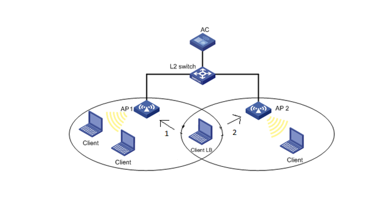
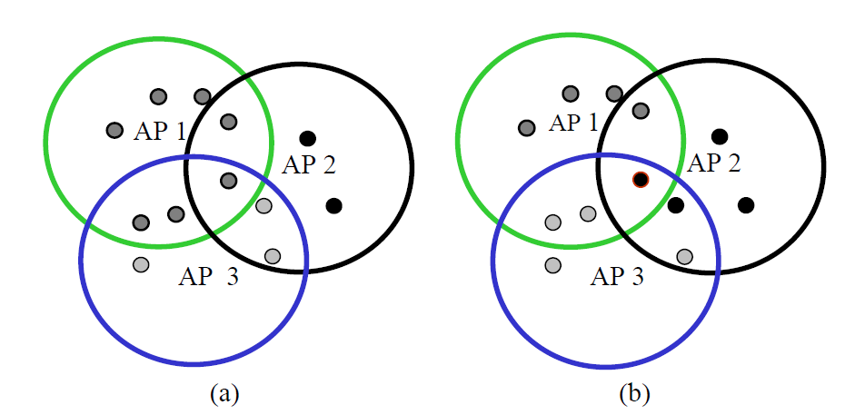
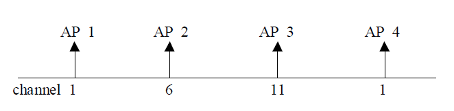
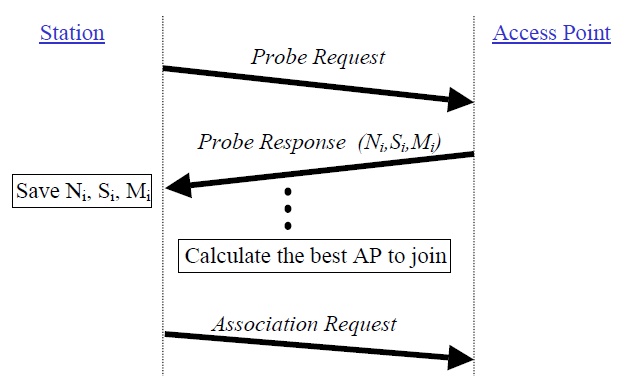

# Slovenská technická univerzita v Bratislave
---
## AP LOAD BALANCE BASED HANDOVER IN SOFTWARE DEFINED WIFI SYSTEMS
### Marko Moravèík, Matúš Sosòak
---
# 1. Úvod

V dnešnej dobe je pre sie�ovıch operátorov problémom zmeni� v bezdrôtovıch systémoch ich sie�ovú stratégiu najmä kvôli nie príliš flexibilnému hardvéru. Všetky bezdrôtové siete sú riadené pod¾a hlavnej normy 802.11. Tieto siete sa vyznaèujú podporou ve¾mi vysokej priepustnosti a sú urèené pre pripojenie ve¾kého poètu klientov. Tieto bezdrôtové siete sú vysielané prístupovımi bodmi (AP), ktoré sú rozmiestnené tak, aby pokryli všetkıch klientov v èo najlepšej miere. No kvôli narastajúcemu poètu klientov dochádza k pre�a�eniu tıchto zariadení a teda následne k  zní�eniu priepustnosti. Riešením ich problému by mohlo by� práve SDN. Jedná sa o softvérovo definované siete, ktorıch hlavnım cie¾om je oddeli� riadiacu vrstvu od sie�ovej infraštruktúry. Èi�e v preklade pou�i� jeden centrálny prvok, ktorı bude riadi� celú prevádzku a tımto prvkom sa nazıva SDN kontrolér. Tento kontrolér by teda bol schopnı rozdeli� mieru zá�a�e medzi viacero AP. Cie¾om nášho projektu je teda zanalyzova� vıhody a nevıhody nasadenia SDN v bezdrôtovıch sie�ach a taktie� porovna� zá�a� siete bez SDN a pri nasadení SDN.

# 2. Návrh riešenia

Pre riešenie nášho projektu sme sa rozhodli pou�i� operaènı systém Windows 10 a  simulátor s názvom Mininet. V tomto simulátore si najprv vytvoríme 3 prístupové body a na ka�dı z nich pripojíme urèitı poèet klientov pomocou bezdrôtovej siete Wi-Fi. Potom jeden z tıchto prístupovıch bodov pre�a�íme tak, �e naòho pripojíme viacero klientov a budeme sledova�, èi náš algoritmus, ktorı je ni�šie popísanı vyhodnotí situáciu správne a prepne u� dlhšie pripojenıch klientov z pre�a�eného prístupového bodu na inı. Všetky doteraz známe algoritmy sa zaoberajú najmä tım, �e sa sna�ia priradi� novıch klientov do AP, ktorá je najmenej vy�a�ená ale neriešia zmenu u� pripojenıch klientov v prípade zá�a�e AP, preto sme sa rozhodli skúma� túto problematiku práve z tohto h¾adiska.

*Obr.1 Schéma návrhu*

Na obr.1 je mo�né vidie� dva prístupové body (AP1 a AP2). Na AP1 sú zatia¾ pripojenı dvaja klienti a na AP2 je to jeden klient. Medzi tımito dvoma prístupovımi bodmi stojí Klient LB, ktorı má rovnako dobrı signál na AP1 ako aj na AP2. Ak nastane pre�a�enie prístupového bodu AP1, tak klienta LB náš algoritmus prepojí na AP2. Obrázok je len ilustraènı, preto�e na pre�a�enie je potrebné, aby bolo na prístupovı bod pripojenıch viacero klientov.

**Algoritmus vyva�ovania zá�a�e medzi AP:**

1. Kontroler dostane informáciu o za�a�ení od AP vo WLAN systéme
2. Kontroler porovná za�a�enie ka�dého AP s hraniènou hodnotou
3. Zaèiatok loopu
4. **IF** (za�a�enie AP &gt; Hranièná (threshold) hodnota)

- AP je pre�a�ené
- neprijímaj nové stanice

5. **ELSE IF** (za�a�enie AP &lt; Hranièná hodnota)

- AP je málo pre�a�ené
- prijímaj nové stanice

6. **IF** (stanica sa dostane do oblasti prekrytie AP signálov, priraï stanicu k málo za�a�enému AP)
- skontroluj susedné AP, èi je mu mo�né priradi� stanicu
- starému AP pošli správu o oddelení stanice, aby sa stanica mohla oddeli�
- priraï stanicu novému AP

7. **ELSE**
- �iadne priradenie stanice sa nekoná
8. Koniec loopu

# 3.   Súvisiace riešenia

Autori v [4] sa zamerali na mód infraštruktúry, kde riešia problémy za�a�enie medzi AP.

### 3.1   Popis problému

Na obrázku 2(a) je mo�né vidie� rozdelenie 7 bezdrôtovıch staníc, ktoré sú napojené na AP1 a len 2 na AP2 a 3 na AP3. Takéto rozdelenie mô�e spôsobi� stratu paketov na AP1 (zlá funkcia siete) v porovnaní s AP2 a AP3. Takáto situácia doká�e by� vyriešená vyrovnaním poètu staníc medzi všetkımi AP. Na obrázku 2(b) mô�eme vidie� rovnomerné rozdelenie staníc medzi AP, po aplikovaní vhodného algoritmu vyvá�enie zá�a�e. To vedie k zlepšeniu funkcii siete.

*Obr. 2: (a) Asymetria v priraïovaní staníc
(b) Symetria v priraïovaní staníc*

### 3.2   Pridelenie bezdrôtovej stanice k AP

**3.2.1   Klasické prístupy**

Postup pridelenia stanice k AP je vo väèšine systémov nasledovnı. WS (wireless station) preh¾adá dostupné kanály ka�dého AP v dosahu a poèúva k Beacon alebo Probe Response Frames (1-14 rôznych kanálov). WS ukladá RSSI (Received Signal Strength Indicator – sila signálu) Becaonu alebo PRF a ostatné potrebné informácie, ako je ESSID, heslovanie (on/off) atd. Po skonèení preh¾adávania, WS zvolí AP s maximálnym RSSI, s tım, �e AP spåòa aj všetky ostatné po�iadavky (ESSID, WEP zaheslovanie). WS sa odpojí od AP, ak RSSI klesne pod danú preddefinovanú hranicu. Táto procedúra je zalo�ená na presvedèení, �e kvalita takto zvoleného AP je najlepšia. Avšak, táto procedúra vedie k vısledkom, �e viaceré stanice sú pripojené iba na pár AP, kım ostatné susedné AP zostávajú neèinné. Takéto pre�a�enie AP vedie k poklesu vıkonu. Preto je potrebnı algoritmus ktorı vezme v úvahu stav ka�dého AP a WS, ktoré su na neho v tom momente priradené, za úèelom priradenia nového WS k tomuto AP.

**3.2.2   Dynamickı prístup vyva�ovania zá�a�e**

Pri dynamickom prístupe, pripojenie WS na dané AP, zále�í od poètu u� pripojenıch staníc k tomuto AP a priemerná RSSI hodnota. Autori tohto riešenia navrhli algoritmus dynamického vyva�ovania zá�a�e, ktorı sa zameriava na vylepšenie celkového vıkonu siete minimálnym funkcionálnym zhoršením AP a WS. Tento algoritmus funguje v troch úrovniach.

- Úroveò automatickej vo¾by kanálu pre AP - zameriava sa na èo najlepšie rozdelenie AP do dostupnıch kanálov
- Úroveò rozhodovania o pripojení stanice k AP - urèuje spôsob, akım si WS vyberie AP, ku ktorému sa priradí.
- Úroveò pozorovania odkazov - urèuje, kedy WS opustí danı AP a kedy sa vykoná roamingová funkcia.

**Úroveò automatického vıberu kanálu pre AP**

Na zaèiatku fázy ka�dého AP, je AP informované o existencii inıch AP v jeho okolí, pou�itím komunikaèného protokolu IEEE, navrhnutého pre servis roamingovıch slu�ieb. Jedná sa o Inter Access Point Protocol (IAPP), ktorı prenáša všetky potrebné informácie, èo dokazuje, �e AP slu�ba má rovnakú LAN. V tom istom èase, aktívne AP preh¾adá kanály, aby zistil ktoré AP sú susedmi. Okrem toho je informovanı o operaènıch kanáloch susedného AP. Tieto informácie pou�íva na to, aby zaèali pou�íva� ako operaènı kanál ten, v ktorom je rušenie od susedného AP èo najni�šie. To vedie k najlepšej kvalite komunikácie s WS. Táto úroveò algoritmu vyvá�enia za�a�enia je skôr inicializaènou úrovòou, kde sú podmienky operácie siete normalizované. Je to potrebná úroveò, preto�e väèšina sie�ovıch administrátorov ignoruje základné aspekty bezdrôtovıch sietí. Doteraz neexistuje �iadny AP s úrovòou automatického vıberu kanála pre AP kvôli �a�kostiam pri implementácii. Èo sa tıka poèiatoèného operaèného kanála, je zvolenı ako 1 alebo 6 alebo 11 (pre USA s 1 a� 14 kanálmi), ako je to znázornené na obrázku 2. Rovnaká vzdialenos� medzi tımito kanálmi (1, 6, 11 ...) poskytuje minimálnu interferenciu medzi susediacimi AP.

*Obr. 3: Poèiatoènı automatickı vıber kanálu pre AP v pásme 14 kanálov*

**Úroveò rozhodovania o pripojení stanice k AP**

*Obr. 4: Postup na úrovni rozhodovania o pripojení*

Ni - poèet staníc priradenıch k AP
Si - RSSI hodnota Probe Requestu na AP
Mi - Priemerná RSSI hodnota pre skupinu staníc priradenıch k AP

# 4. Zdroje

[1] D.Gong and Y.Yang, &quot;AP association in 802.11 n wlans with heterogeneous clients,&quot; in INFOCOM, 2012 Proceedings IEEE, 2012, pp. 1440-1448

[2] A. Balachandran, P. Bahl, and G. M. Voelker, &quot;Hot-spot congestion relief in public-area wireless networks,&quot; in Mobile Computing Systems and Applications.

[3] S-T.Sheu and C-C.Wu, &quot;Dynamic Load Balance Algorithm (DLBA) for IEEE 802.11 Wireless LAN,&quot; Tamkang Journal of Science and Engineering, vol. 1, pp. 45-52, 1999.

[4] I.Papanikos and M.Logothetis, &quot;A Study on Dynamic Load Balance for IEEE 802.11b Wireless LAN,&quot; in 8th International Conference on Advances in Communication and Control (COMCON), 2001.